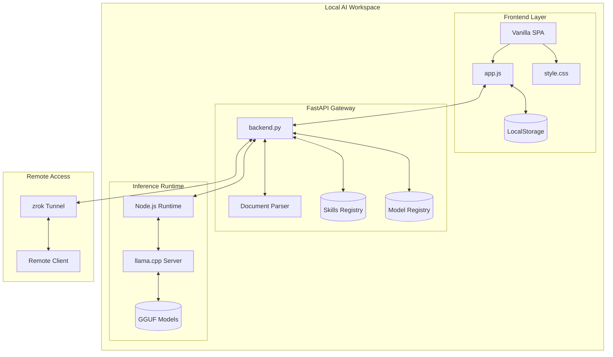
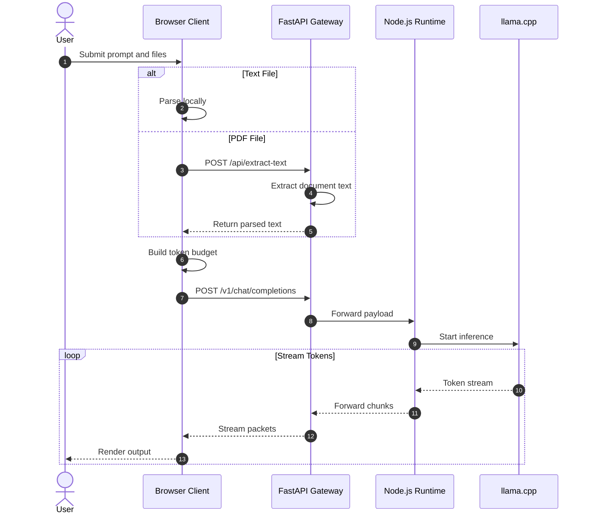
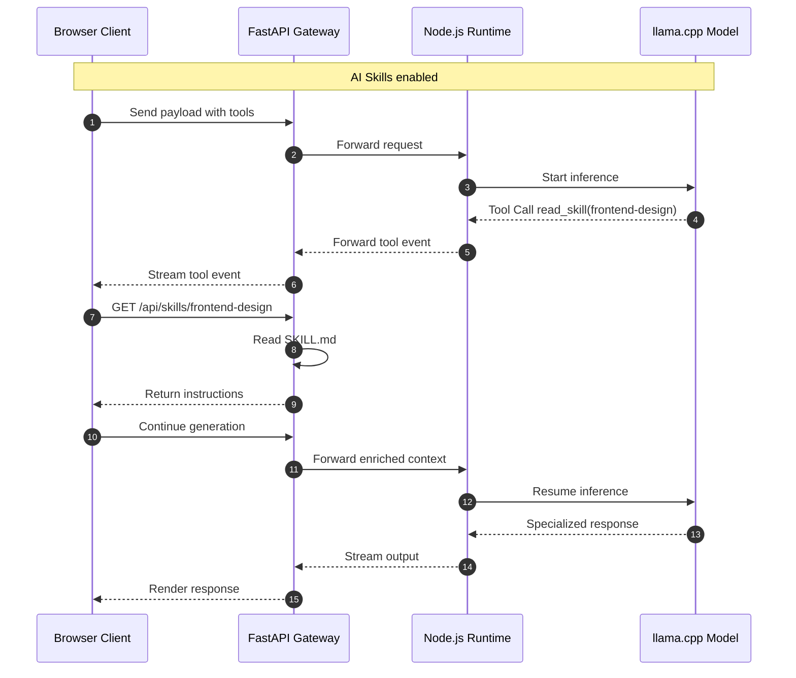
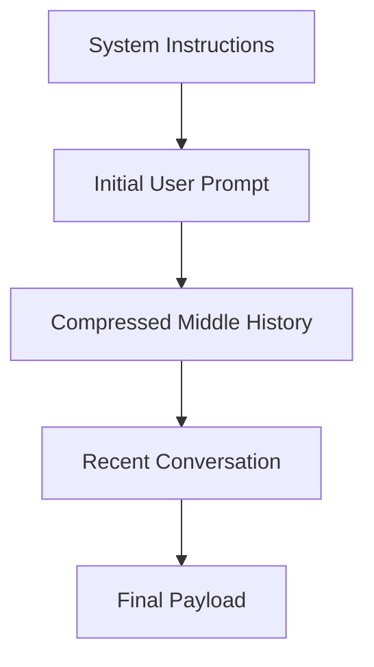

# Andromeda AI

> Enterprise-grade local AI workspace powered by FastAPI, Node.js, llama.cpp, GGUF models, and local inference pipelines. 

Andromeda AI is a secure, local-first AI platform designed to deliver production-grade LLM workflows entirely on local infrastructure.

The platform combines:

* FastAPI middleware orchestration
* Node.js runtime management
* llama.cpp inference execution
* GGUF model deployment
* Local document processing pipelines
* Client-side RAG workflows
* Dynamic AI Skill injection
* Streaming inference interfaces
* Secure remote access tunneling

All prompts, documents, embeddings, inference traces, and conversations remain under local control.

---

# Architecture Overview



---

# Request Lifecycle

## Interactive Chat and Local RAG Flow



---

# AI Skills Execution Flow



---

# System Directory Structure

```bash
Andromeda/
├── backend.py
├── server.js
├── models.json
├── requirements.txt
├── package.json
├── start_local.bat
├── start_remote.bat
├── update_models.py
├── public/
│   ├── index.html
│   ├── css/
│   │   └── style.css
│   └── js/
│       └── app.js
├── skills/
│   └── frontend-design/
│       └── SKILL.md
└── models/
    └── *.gguf
```

---

# Core Components

## FastAPI Gateway

`backend.py` acts as the orchestration and middleware layer between the frontend interface and the local inference runtime.

### Responsibilities

* OpenAI-compatible API proxying
* Streaming response forwarding
* Authentication enforcement
* Document ingestion
* AI Skill orchestration
* Runtime status management
* Model registry coordination

### Document Processing Pipeline

Supported formats include:

* PDF
* Markdown
* TXT
* CSV
* JSON
* Python
* JavaScript
* HTML

Extraction stack:

1. PyMuPDF
2. pdfplumber fallback
3. Encoding-safe text decoding

---

## Node.js Runtime Layer

`server.js` manages inference orchestration and communication with llama.cpp.

### Responsibilities

* Launching llama.cpp inference services
* Streaming token forwarding
* OpenAI-compatible payload normalization
* Runtime lifecycle monitoring
* Model process management

---

## Frontend Runtime

The frontend is implemented as a lightweight Vanilla JavaScript SPA.

### Features

* Streaming markdown rendering
* Syntax-highlighted code blocks
* Dynamic reasoning panels
* Persistent local state storage
* Token budget management
* Theme and UI state preservation

---

# Token Budgeting and Context Compression

Andromeda implements a custom context compression pipeline to prevent context overflow during long-running sessions.

Target context limit:

```txt
24,000 tokens ≈ 84,000 characters
```

---

## Compression Strategy



The compression engine preserves:

* System instructions
* Initial task objectives
* Most recent conversational state

Older intermediary history is truncated first.

---

# API Reference

| Endpoint             | Method | Description                       |
| -------------------- | ------ | --------------------------------- |
| `/api/models`        | GET    | Returns available models          |
| `/api/models/load`   | POST   | Loads a selected model            |
| `/api/status`        | GET    | Returns runtime status            |
| `/api/extract-text`  | POST   | Extracts text from uploaded files |
| `/api/skills`        | GET    | Lists installed AI Skills         |
| `/api/skills/{name}` | GET    | Returns skill instruction content |
| `/v1/{path:path}`    | ALL    | OpenAI-compatible inference proxy |

---

# Runtime Modes

## Local Workspace Mode

```bash
start_local.bat
```

Launches:

* FastAPI gateway
* Node.js orchestration runtime
* llama.cpp inference backend
* Browser-based SPA interface

Default endpoint:

```txt
http://localhost:8080
```

---

## Secure Remote Access Mode

```bash
start_remote.bat
```

Creates a secure zrok tunnel for remote WAN access without exposing local ports directly.

Example endpoint:

```txt
https://your-instance.share.zrok.io
```

---

# Security Model

Andromeda follows a strict local-first execution model.

## Local Data Residency

The following remain local unless explicitly shared:

* prompts
* uploaded documents
* embeddings
* inference outputs
* reasoning traces
* conversation history

---

# Architectural Goals

The platform is designed around the following principles:

* Local-first execution
* Open inference standards
* Offline-capable workflows
* Modular orchestration
* Streaming-first UX
* Extensible AI Skills system
* OpenAI-compatible interoperability
* Minimal frontend overhead

---

# Future Expansion Areas

* Multi-agent orchestration
* Distributed inference routing
* Local vector database integration
* GPU-aware scheduling
* Voice interaction pipelines
* Plugin-based workspace extensions
* Collaborative local workspaces

---

# License

MIT License

---

# Closing Notes

Andromeda AI combines:

* FastAPI
* Node.js orchestration
* llama.cpp
* GGUF inference runtimes
* Local RAG pipelines
* Dynamic AI Skill injection
* Streaming reasoning interfaces

to provide a fully sovereign AI workspace architecture optimized for local inference environments.
