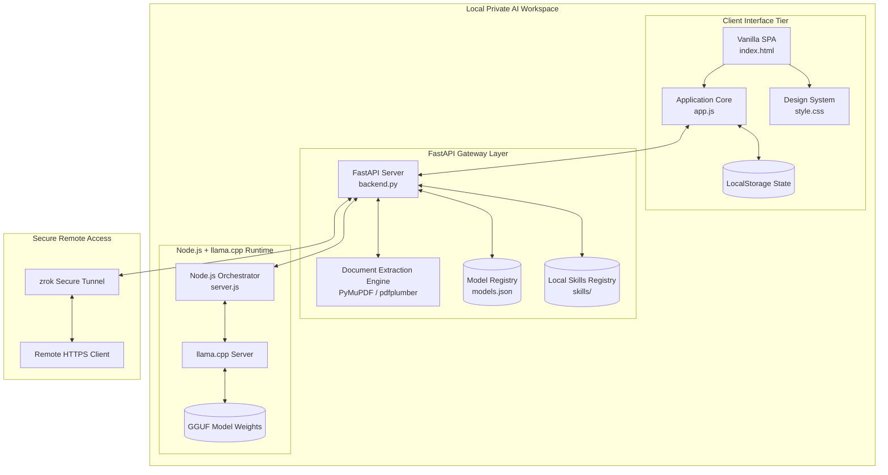
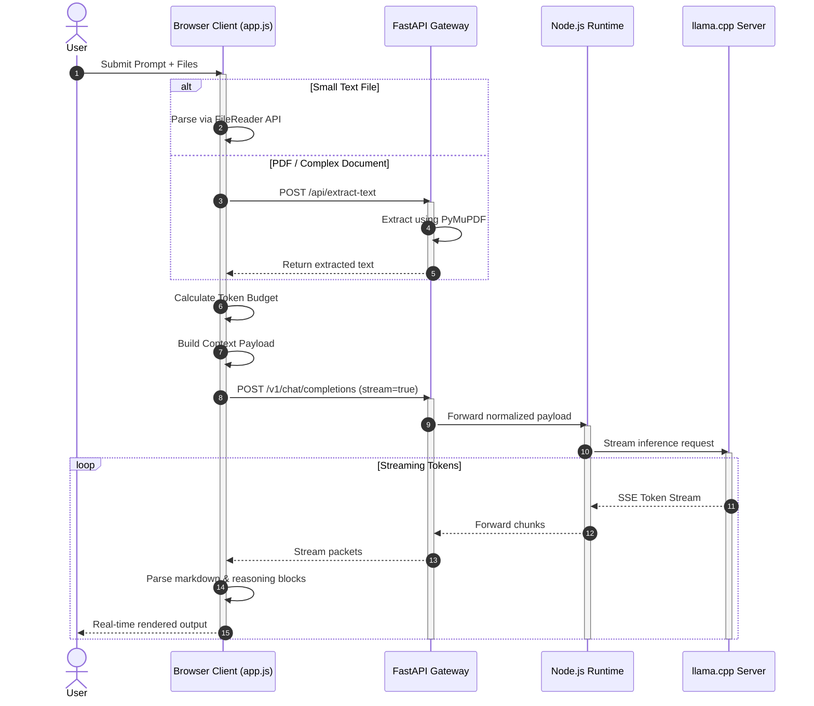
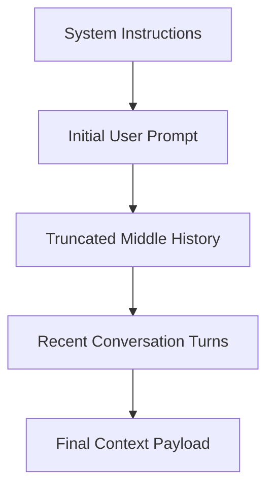

# 🌌 Andromeda AI: Enterprise Architectural Blueprint

Andromeda AI is a secure, **local-first AI workspace** engineered to deliver production-grade LLM experiences directly on your machine.
It combines a responsive browser-based interface, a high-performance **FastAPI Gateway**, and a **Node.js-powered llama.cpp orchestration layer** to create a fully private AI environment with offline autonomy, client-side RAG, streaming inference, and dynamic AI skill execution.

Unlike cloud AI platforms, Andromeda keeps all inference, memory, and document processing local — ensuring complete data residency, low latency, and full control over your models.

---

# 🏛️ System Architecture Overview

The platform follows a decoupled multi-tier architecture:

* **Frontend Tier** → Lightweight SPA interface
* **Gateway Tier** → FastAPI middleware and orchestration APIs
* **Inference Tier** → Node.js runtime controlling llama.cpp
* **Model Layer** → GGUF weights accelerated locally

---

## 🔷 High-Level Component Topology



---

# 🔄 Execution & Data Lifecycle Flows

Andromeda operates through two primary runtime flows:

1. **Interactive Streaming + Client-Side RAG**
2. **Autonomous AI Skill Injection**

---

# 1️⃣ Interactive Prompt & Client-Side RAG Cycle

When a user submits prompts with PDFs, source code, or images attached, Andromeda performs local extraction, token budgeting, and streamed inference generation.



---

# 2️⃣ Autonomous AI Skill Execution Sequence

Andromeda supports dynamic **AI Skills**, enabling models to request domain-specific instruction packs during inference.

```mermaid
sequenceDiagram
    autonumber

    participant UI as Browser Client
    participant API as FastAPI Gateway
    participant NODE as Node.js Runtime
    participant LLM as llama.cpp Model

    Note over UI,LLM:
        AI Skills enabled and prompt matches a technical workflow

    UI->>API: Send chat payload with tool schema
    API->>NODE: Forward payload + tools
    NODE->>LLM: Start inference

    LLM-->>NODE: Tool Call → read_skill("frontend-design")

    NODE-->>API: Forward tool invocation
    API-->>UI: Stream tool event

    UI->>API: GET /api/skills/frontend-design

    API->>API: Read SKILL.md from filesystem
    API-->>UI: Return instructions

    UI->>API: Re-trigger generation with injected context
    API->>NODE: Forward enriched payload
    NODE->>LLM: Continue inference

    LLM-->>NODE: High-quality specialized response
    NODE-->>API: Stream output
    API-->>UI: Render final response
```

---

# 📂 System Directory Structure

```bash
Andromeda/
├── backend.py                 # FastAPI gateway proxy & API layer
├── server.js                  # Node.js orchestration runtime for llama.cpp
├── models.json                # Local model registry
├── requirements.txt           # Python dependencies
├── package.json               # Node.js runtime dependencies
├── start_local.bat            # Local LAN startup launcher
├── start_remote.bat           # Remote WAN launcher via zrok
├── update_models.py           # Synchronizes available GGUF models
├── public/
│   ├── index.html             # Main SPA shell
│   ├── css/
│   │   └── style.css          # UI design system
│   └── js/
│       └── app.js             # Frontend runtime & streaming logic
├── skills/
│   └── frontend-design/
│       └── SKILL.md           # Specialized instruction pack
└── models/
    └── *.gguf                 # Local model weights
```

---

# 🛠️ In-Depth Component Breakdown

## 1️⃣ Gateway Middleware — `backend.py`

The FastAPI gateway acts as the secure middleware between the frontend and the local inference runtime.

### Core Responsibilities

* Streaming proxy for OpenAI-compatible APIs
* File extraction & preprocessing
* Authentication enforcement
* Skill orchestration
* Request normalization

### Streaming Pipeline

The gateway uses asynchronous streaming via:

* `httpx.AsyncClient`
* `StreamingResponse`
* chunked SSE forwarding

This minimizes latency and memory overhead during long-context inference sessions.

### Document Ingestion Layer

Supported formats include:

* PDF
* Markdown
* JSON
* CSV
* Python
* JavaScript
* HTML
* Plain text

Extraction stack:

1. **PyMuPDF** (`fitz`) for high-speed parsing
2. Automatic fallback to `pdfplumber`
3. Safe multibyte decoding support

### Local Authentication Layer

If `ANDROMEDA_API_KEY` is configured:

* All requests require Bearer authentication
* The gateway acts as a local firewall
* Remote WAN access remains protected

---

## 2️⃣ Client Runtime — `public/js/app.js`

The frontend is intentionally framework-free for minimal overhead and maximum responsiveness.

### Core Features

* Streaming markdown renderer
* Dynamic reasoning accordion blocks
* Token budgeting engine
* Persistent local state
* AI skill orchestration
* Syntax-highlighted code rendering

### Thinking Block Parser

Reasoning models often emit structured thought traces:

```txt
<think>
Analyzing request...
</think>
```

Andromeda intercepts these blocks and renders them inside collapsible UI accordions while streaming the primary answer separately.

### Persistent State Machine

The local storage engine preserves:

* Chat history
* Theme preferences
* System prompts
* AI skill configurations
* Saved personas

All state remains fully local.

---

# 📏 Token Budgeting & History Compression

To prevent context overflow while preserving conversational quality, Andromeda implements a custom trimming strategy.

Target budget:

```txt
24,000 tokens ≈ 84,000 characters
```

---

## Context Preservation Strategy



This ensures:

* Original objectives remain preserved
* Recent context remains prioritized
* Older middle turns are compressed first

Massive “context window collapse” moments?
Absolutely obliterated. 💀

---

# 📡 API Reference Registry

| Endpoint             | Method | Description                                      |
| -------------------- | ------ | ------------------------------------------------ |
| `/api/models`        | `GET`  | Returns available GGUF models and active runtime |
| `/api/models/load`   | `POST` | Loads a specified model                          |
| `/api/status`        | `GET`  | Returns runtime health and inference status      |
| `/api/extract-text`  | `POST` | Extracts text from uploaded documents            |
| `/api/skills`        | `GET`  | Lists installed AI skills                        |
| `/api/skills/{name}` | `GET`  | Returns a skill instruction pack                 |
| `/v1/{path:path}`    | `ALL`  | OpenAI-compatible inference proxy                |

---

# ⚙️ Runtime & Deployment

## 🔌 Hardware Requirements

### Required Components

1. Python 3.11+
2. Node.js Runtime
3. llama.cpp server build
4. GGUF-compatible model
5. 8GB+ RAM recommended
6. GPU acceleration optional but recommended

---

# 🚀 Running Andromeda

---

## Option A — Local LAN Workspace

```bash
start_local.bat
```

### Actions Performed

* Validates Python dependencies
* Starts FastAPI gateway
* Launches Node.js orchestration runtime
* Starts llama.cpp server
* Opens browser at:

```txt
http://localhost:8080
```

---

## Option B — Secure WAN Access

```bash
start_remote.bat
```

### Actions Performed

* Starts local services
* Creates encrypted zrok tunnel
* Exposes secure HTTPS endpoint

Example:

```txt
https://your-private-instance.share.zrok.io
```

No port forwarding.
No cloud inference.
No “your data may be used for training” jumpscare. 💀

---

## Option C — Model Synchronization Utility

```bash
update_models.py
```

### Purpose

* Detects locally available GGUF models
* Updates `models.json`
* Synchronizes runtime registry
* Refreshes frontend model list

---

# 🔐 Security Philosophy

Andromeda follows a strict **local-first security model**:

* No cloud inference
* No telemetry
* No external vector DB
* No forced account system
* No hidden API dependencies

All:

* prompts,
* embeddings,
* files,
* chats,
* reasoning traces,
* and model execution

remain fully under user control.

---

# 🌠 Closing Notes

Andromeda AI is designed to blur the boundary between:

* local inference tooling,
* enterprise AI workspaces,
* and fully sovereign computing environments.

By combining:

* FastAPI,
* Node.js orchestration,
* llama.cpp,
* GGUF runtimes,
* local RAG pipelines,
* and dynamic AI skill execution,

the platform delivers a modern AI experience without surrendering privacy or operational ownership.

Local-first AI is no longer a compromise.

It’s the final form. 🚀
