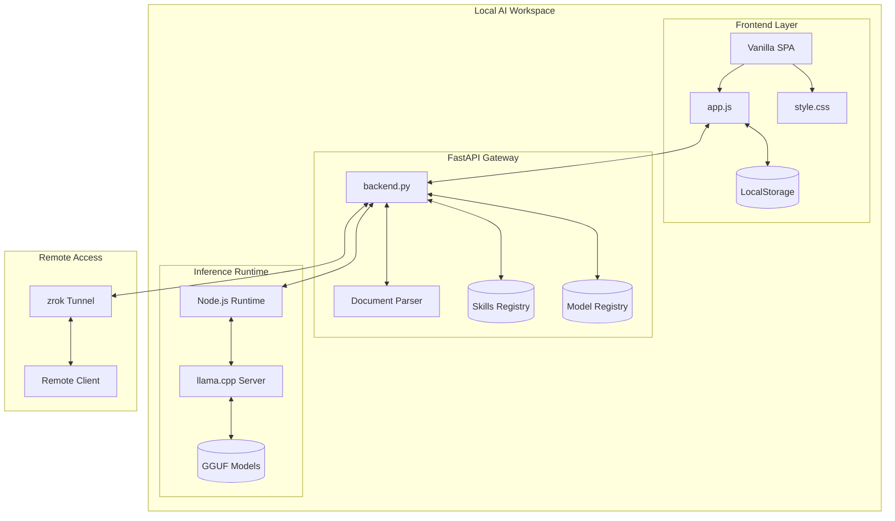
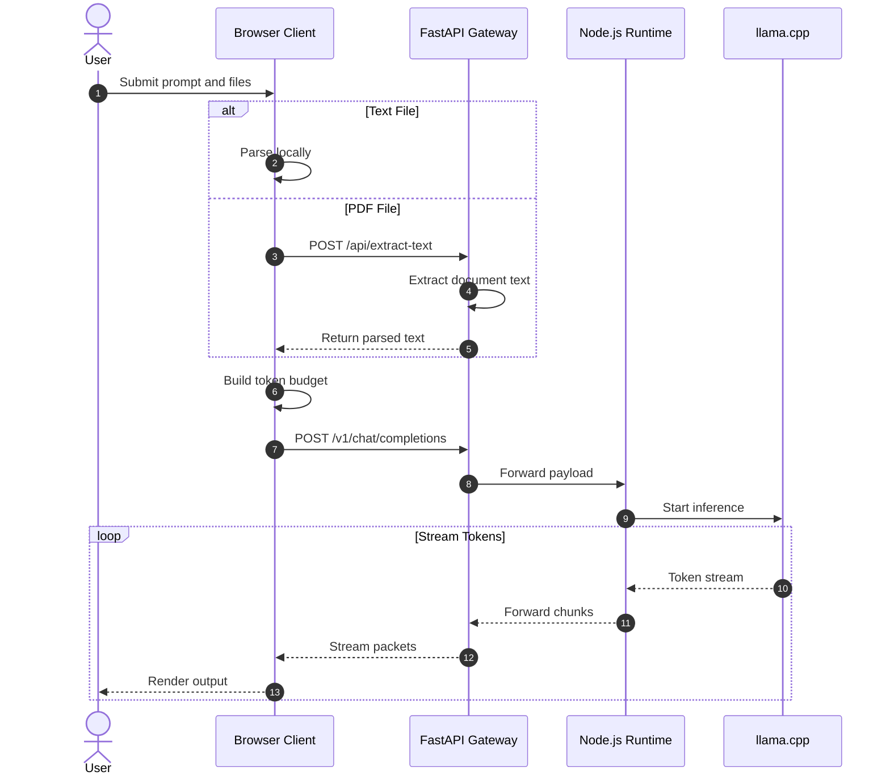
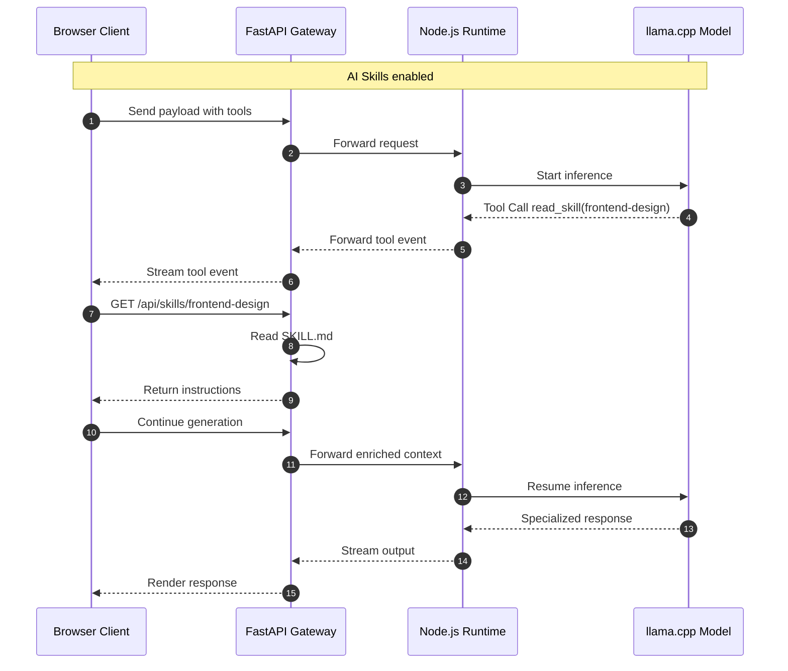
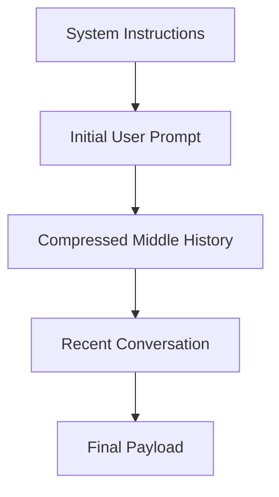

#  Andromeda AI

> Enterprise-grade local AI workspace powered by FastAPI, Node.js, llama.cpp, GGUF models, and fully local inference pipelines.

Andromeda AI is a secure, local-first AI platform designed to deliver production-grade LLM experiences entirely on your own hardware.

It combines:

*  FastAPI middleware
*  llama.cpp inference
*  Node.js orchestration
*  Local RAG pipelines
*  Offline-first privacy
*  Dynamic AI Skills
*  Secure remote tunneling
*  Streaming chat interfaces

Unlike cloud AI services, Andromeda keeps all prompts, files, embeddings, chats, and reasoning traces local.

No telemetry.
No forced APIs.
No “your data may be used for training” nonsense. 💀

---

# Features

*  Local GGUF model execution via llama.cpp
*  OpenAI-compatible `/v1/chat/completions`
*  PDF & document extraction
*  Client-side RAG workflows
*  Dynamic AI Skills system
*  Streaming token responses
*  Thinking/reasoning accordion blocks
*  Persistent local chat history
*  Modern responsive UI
*  API key protection
*  Secure WAN access with zrok
*  Fully offline capable

---

#  Architecture Overview



---

#  Request Lifecycle

## Interactive Chat + Local RAG Flow



---

#  AI Skills Execution Flow



---

#  Project Structure

```bash
Andromeda/
├── backend.py
├── server.js
├── models.json
├── requirements.txt
├── package.json
├── start_local.bat
├── start_remote.bat
├── update_models.py
├── public/
│   ├── index.html
│   ├── css/
│   │   └── style.css
│   └── js/
│       └── app.js
├── skills/
│   └── frontend-design/
│       └── SKILL.md
└── models/
    └── *.gguf
```

---

# 🛠 Core Components

## FastAPI Gateway

`backend.py` acts as the middleware between the frontend and local inference runtime.

### Responsibilities

* OpenAI-compatible API proxy
* Streaming response forwarding
* Authentication enforcement
* Document extraction
* AI Skill orchestration
* Local model management

### Supported Formats

* PDF
* Markdown
* TXT
* CSV
* JSON
* Python
* JavaScript
* HTML

### Extraction Stack

* PyMuPDF
* pdfplumber fallback
* Safe encoding fallbacks

---

## Node.js Runtime

`server.js` manages communication with llama.cpp.

### Responsibilities

* Launch llama.cpp server
* Stream inference requests
* Normalize OpenAI-compatible payloads
* Runtime monitoring
* Model lifecycle management

---

## Frontend Runtime

The frontend is a lightweight Vanilla JavaScript SPA.

### Features

* Streaming markdown rendering
* Syntax highlighting
* Thinking block parser
* Persistent local storage
* Dynamic theme system
* Token budget compression

---

# 📏 Token Budgeting

Andromeda uses a custom context compression algorithm to avoid context overflow.

Target limit:

```txt
24,000 tokens ≈ 84,000 characters
```

---

## Compression Strategy



This preserves:

* original objectives
* recent context
* system instructions

while trimming older middle history first.

---

# API Endpoints

| Endpoint             | Method | Description               |
| -------------------- | ------ | ------------------------- |
| `/api/models`        | GET    | List available models     |
| `/api/models/load`   | POST   | Load a model              |
| `/api/status`        | GET    | Runtime status            |
| `/api/extract-text`  | POST   | Extract text from files   |
| `/api/skills`        | GET    | List installed skills     |
| `/api/skills/{name}` | GET    | Return skill instructions |
| `/v1/{path:path}`    | ALL    | OpenAI-compatible proxy   |

---

#  Installation

## Requirements

* Python 3.11+
* Node.js 20+
* llama.cpp
* GGUF model
* 8GB+ RAM recommended

---

## 1. Clone Repository

```bash
git clone https://github.com/yourname/andromeda-ai.git
cd andromeda-ai
```

---

## 2. Install Python Dependencies

```bash
pip install -r requirements.txt
```

---

## 3. Install Node.js Dependencies

```bash
npm install
```

---

## 4. Setup llama.cpp

Build or download llama.cpp and start the server:

```bash
llama-server -m models/your-model.gguf --port 1234
```

---

# Running Andromeda

## Local Mode

```bash
start_local.bat
```

Launches:

* FastAPI gateway
* Node.js runtime
* llama.cpp connection
* Browser UI

Accessible at:

```txt
http://localhost:8080
```

---

## Remote Access Mode

```bash
start_remote.bat
```

Creates a secure zrok tunnel for remote access.

Example:

```txt
https://your-instance.share.zrok.io
```

No port forwarding required.

---

# Security Model

Andromeda follows a strict local-first philosophy.

## Data Never Leaves Your Machine

* prompts
* files
* embeddings
* chats
* inference
* reasoning traces

remain local unless explicitly shared.

---

## Optional API Authentication

Set:

```bash
ANDROMEDA_API_KEY=your_key
```

to enable Bearer token authentication.

---

# Future Roadmap

* Multi-agent orchestration
* Local vector database support
* Voice interaction pipeline
* GPU scheduling system
* Workspace plugins
* Distributed inference clusters
* Live collaborative sessions

---

# License

MIT License

---

# Final Notes

Andromeda AI combines:

* FastAPI
* Node.js
* llama.cpp
* GGUF local inference
* AI Skill injection
* client-side RAG
* streaming reasoning interfaces

to create a modern AI workspace that remains fully sovereign.
